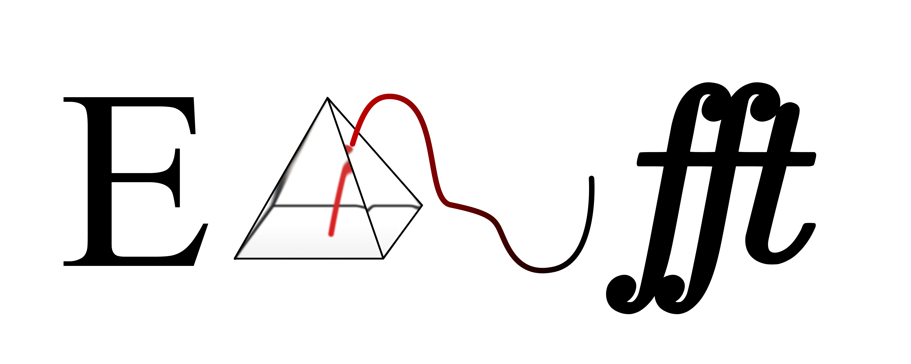

# Elastic Non-Uniform FFT (ENUFFT)



<p align="center">
  <a href="https://pypi.org/project/enufft/"></a>
  <a href="https://doi.org/10.5281/zenodo.20544458"></a>
  <a href="https://doi.org/10.5281/zenodo.20545261"></a>
  <a href="LICENSE"></a>
</p>

ENUFFT is a framework that computes local Fourier coefficients directly from irregular DEM samples without physical interpolation. A shape-aware elastic mode-selection algorithm then selects a cell and flow-dependent number of retained modes that preserves a target fraction of launch-relevant power.

## Overview

Two reusable compute cores are provided. Quadrature-based Fourier coefficients from irregular terrain samples are evaluated by `Module_Nufft.py`. Any nonnegative spectrum is compressed into an adaptive retained mode count by `Module_Ems.py`. These cores are combined by the case drivers with geometry, preprocessing, comparison, and figure-construction code for the synthetic NUFFT check, the EMS theory panels, the monochromatic unstructured-cell test, the Alpine SRTM sweep, and the mountain-wave EMS extraction.

## Installable Python Package

The ENUFFT compute core is also available as an installable Python package:

```bash
pip install enufft
```

The package source lives in [`package/`](package/), with API notes in [`package/docs/API.md`](package/docs/API.md). It exposes the polygon NUFFT workflow, Elastic Mode Selection, sparse conjugate-mode reconstruction, and direct DFT validation routines without changing the research scripts at the repository root.

### EMS Core

A nonnegative spectrum is reduced by Elastic Mode Selection to the number of retained modes needed to preserve a spectrum-dependent target power fraction under a prescribed mode budget. The spectrum is sorted as

$$
E_{(1)}\ge E_{(2)}\ge\cdots\ge E_{(J^\star)}\ge 0,
\qquad
S=\sum_{j=1}^{J^\star}E_{(j)}.
$$

The participation ratio is

$$
N_{\mathrm{eff}}=
\frac{(\sum_{j=1}^{J^\star}E_{(j)})^2}
{\sum_{j=1}^{J^\star}E_{(j)}^2},
\qquad
N_{\mathrm{eff}}^{\mathrm{clip}}=\min(N_{\mathrm{eff}},K_{\max}).
$$

The local shape of the leading spectrum is measured by the gap ratios

$$
G_j=\frac{E_{(j)}}{E_{(j+1)}},
\qquad
j=1,\ldots,J_{\mathrm{window}}-1,
\qquad
J_{\mathrm{window}}=\min(J^\star,K_{\max}),
$$

and by the neighbor-similarity score

$$
S_\delta=
\frac{1}{J_{\mathrm{window}}-1}
\sum_{j=1}^{J_{\mathrm{window}}-1}
\exp[-\frac{G_j-1}{\delta}]
$$

when $J_{\mathrm{window}}>1$. If only one admissible entry is present, $S_\delta=1$. The blended EMS control variable is written in the manuscript notation as

$$
\mathcal C=w_1\frac{N_{\mathrm{eff}}^{\mathrm{clip}}}{K_{\max}}+w_2S_\delta,
\qquad
w_1+w_2=1,
$$

from which the target retained fraction is obtained as

$$
\alpha_C=
\alpha_{\min}+(\alpha_{\max}-\alpha_{\min})\mathcal C.
$$

The cumulative retained fraction is

$$
\vartheta(K)=\frac{\sum_{j=1}^{K}E_{(j)}}{S},
$$

and the selected count is

$$
K^\star=
\min(K_{\max},
\max[K_{\min},
\min\{K:\vartheta(K)\ge\alpha_C\}]).
$$

This rule is implemented in `Module_Ems.py` by `elastic_mode_selection`. For Fourier coefficient blocks, signed non-DC modes are first grouped by `select_sparse_conjugate_modes` into physical conjugate pairs $g=\{\pm(m,n)\}$, with pair energy

$$
E_{m,n}^{\pm}=\lvert\hat h_{m,n}\rvert^2+\lvert\hat h_{-m,-n}\rvert^2.
$$

Both members of each retained conjugate pair are written to the returned sparse spectrum. The inverse series is thereby kept real-valued, and retained energy accounting is kept consistent with Parseval pairing.

### NUFFT Core

Local Fourier coefficients are approximated by the NUFFT core on a rectangular tangent-plane patch

$$
D=[0,L_x]\times[0,L_y]
$$

from irregular DEM samples

$$
\{x_q,y_q,h_q\}_{q=1}^{Q}.
$$

The continuous coefficient convention is taken from the manuscript

$$
\hat h_{m,n}=
\frac{1}{|D|}
\int_0^{L_x}\int_0^{L_y}
h(x,y)\exp[-i(k_mx+\ell_ny)]\,dy\,dx,
\qquad
k_m=\frac{2\pi m}{L_x},
\qquad
\ell_n=\frac{2\pi n}{L_y}.
$$

The same signed complex convention is evaluated by the code. Optional quadrature weights are first converted to a sample-mean normalization

$$
h_q^\ast=
\begin{cases}
h_q, & w_q\ \mathrm{absent},\\
h_q\dfrac{w_q}{\sum_r w_r}Q, & w_q\ \mathrm{present},
\end{cases}
$$

so that the weighted and unweighted coefficient formula can be written as

$$
\hat h_{m,n}^{\mathrm{DFT}}=
\frac{1}{Q}
\sum_{q=1}^{Q}h_q^\ast
\exp[-i(k_mx_q+\ell_ny_q)].
$$

An even auxiliary grid is built by the accelerated path with

$$
N_x^{\mathrm{aux}}
=\max(\lceil2\sigma M_x\rceil,2M_x,2),
\qquad
N_y^{\mathrm{aux}}
=\max(\lceil2\sigma M_y\rceil,2M_y,2),
$$

where

$$
M_x=\max_m |m|,
\qquad
M_y=\max_n |n|.
$$

The grid spacings are

$$
d_x^{\mathrm{aux}}=\frac{L_x}{N_x^{\mathrm{aux}}},
\qquad
d_y^{\mathrm{aux}}=\frac{L_y}{N_y^{\mathrm{aux}}}.
$$

Samples are spread with the dimensionless Kaiser-Bessel kernel

$$
\varphi(\zeta)=
\begin{cases}
\dfrac{1}{I_0(\beta)}I_0[\gamma\sqrt{1-(\zeta/a)^2}], & |\zeta|\le a,\\
0, & |\zeta|>a.
\end{cases}
$$

Here $a$ is the half width in auxiliary-grid cells. The optimized kernel used in the paper cases is defined by

$$
\gamma=\pi\sqrt{(2a)^2(\beta/\pi)^2-0.8},
\qquad
\beta=2.34.
$$

For the baseline comparison, $\gamma=\beta$ is set. The spread field is

$$
\tilde h_{j,i}=
\sum_{q=1}^{Q}h_q^\ast
\varphi(\frac{x_q-x_i^{\mathrm{aux}}}{d_x^{\mathrm{aux}}})
\varphi(\frac{y_q-y_j^{\mathrm{aux}}}{d_y^{\mathrm{aux}}}),
$$

with periodic shortest-distance wrapping in each direction and compact support supplied by $\varphi$. The grid-space normalization is then applied as

$$
\tilde h_{j,i}
\leftarrow
\tilde h_{j,i}
\frac{N_x^{\mathrm{aux}}N_y^{\mathrm{aux}}}{Q}.
$$

A standard FFT is then used to obtain

$$
\hat{\tilde h}_{m,n}=
\frac{1}{N_x^{\mathrm{aux}}N_y^{\mathrm{aux}}}
\mathrm{FFT2}(\tilde h)_{m,n}.
$$

Deconvolution is performed by division through the grid-space Fourier transform of the one-dimensional spreading kernel in each direction

$$
\hat h_{m,n}^{\mathrm{NUFFT}}=
\frac{\hat{\tilde h}_{m,n}}
{\Phi(k_m)\Phi(\ell_n)}.
$$

For a wavenumber $\kappa$ and matching auxiliary spacing $d_\kappa$, the transform used by the code is

$$
\Phi(\kappa)=
\frac{2a}{I_0(\beta)}
\frac{\sinh[\sqrt{\gamma^2-(a\kappa d_\kappa)^2}]}
{\sqrt{\gamma^2-(a\kappa d_\kappa)^2}},
$$

with the usual $\sin(s)/s$ continuation when the square-root argument is negative. Only the requested signed modes are kept in the final returned block

$$
-M_x\le m\le M_x,
\qquad
-M_y\le n\le M_y.
$$

The mathematical target remains the direct quadrature coefficient. Only the evaluation strategy is changed by the NUFFT chain, with the dominant cost reduced from direct summation over every sample and every mode to spreading, FFT, deconvolution, and block extraction.

## Repository Setup

Clone the repository with its PinCFlow companion fork:

```bash
git clone --recurse-submodules https://github.com/TridibBanerjee/Elastic-Non-Uniform-FFT.git
```

If the repository was cloned without submodules, initialize the public PinCFlow fork afterward:

```bash
git submodule update --init --recursive
```

## License

This repository is licensed under the Apache License 2.0. See [LICENSE](LICENSE).

Attribution notices for the ENUFFT framework are provided in [NOTICE](NOTICE). If you use ENUFFT in scholarly, published, or publicly distributed work, please cite it using [CITATION.cff](CITATION.cff).

The `PinCFlow-EMS` submodule is a separate project with its own license. See the [PinCFlow-EMS license](https://github.com/TridibBanerjee/PinCFlow-EMS/blob/EMS/LICENSE.md).

## Documentation Index

The remaining documentation is split into three short references. Shared numerical routines are in Modules. Case drivers and data flow are in Code. Figure-construction helpers are in Plot.

- [Modules](readme_modules.md): shared helper, NUFFT, CSA, EMS, Alps, CSV, and plotting-template modules.
- [Code](readme_code.md): case-driver implementation, Alps distributed-task logic, and compute data flow.
- [Plot](readme_plot.md): figure-construction drivers and plotting helper implementation.
