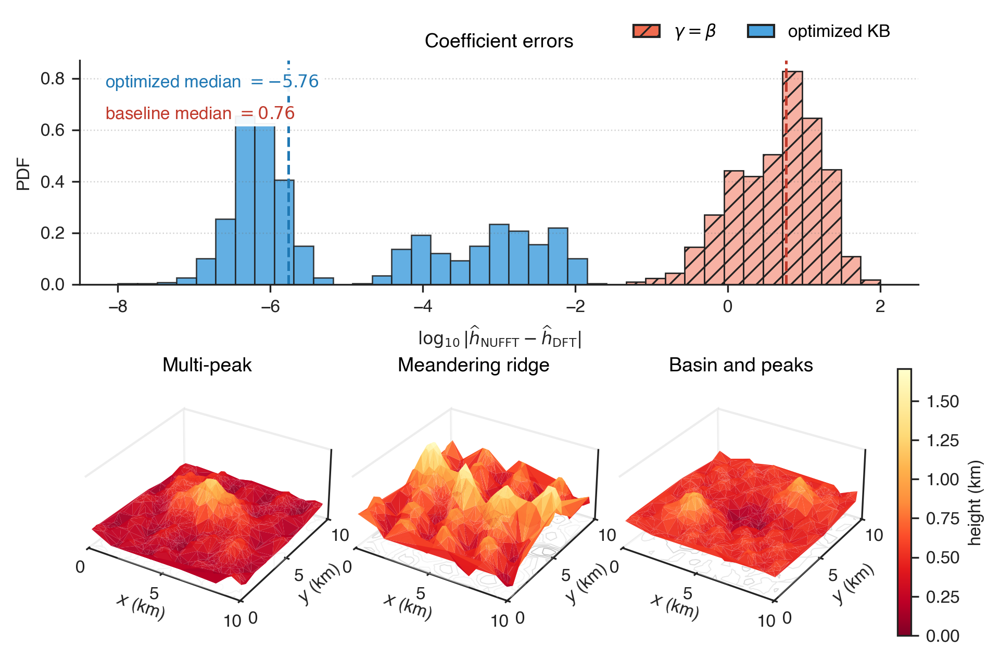
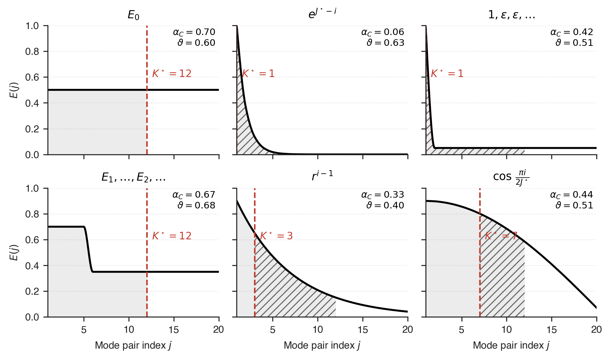
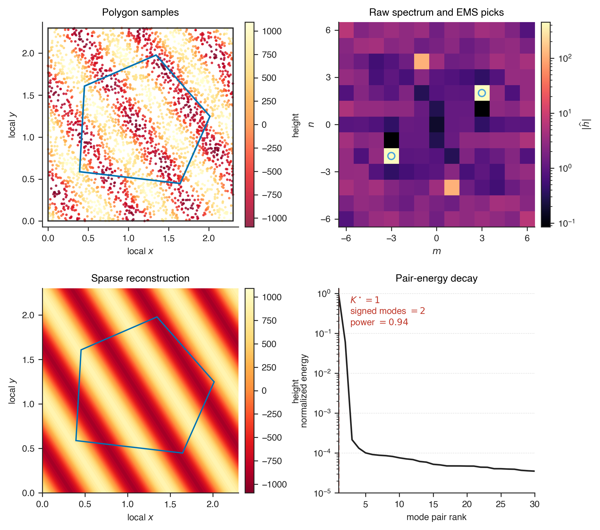

# ENUFFT

Elastic Non Uniform FFT is a Python module for local Fourier analysis on
irregularly sampled terrain or other scattered two dimensional fields.

> Part of the **ENUFFT** framework created by **Tridib Banerjee**. The research
> code, the full mathematical derivation, and citation metadata live at the root
> of this repository,
> [TridibBanerjee/Elastic-Non-Uniform-FFT](https://github.com/TridibBanerjee/Elastic-Non-Uniform-FFT).

The module combines a Kaiser Bessel non uniform FFT with Elastic Mode Selection.
The NUFFT step estimates local Fourier coefficients from scattered samples
without first interpolating the field to a regular grid. The EMS step compresses
the resulting spectrum to a data dependent number of retained conjugate mode
pairs.

The main use case is a polygonal cell or patch. A user supplies points, values,
and a polygon. ENUFFT prescribes an analytic square Fourier window from that
polygon, computes the local coefficient block, applies EMS, and returns both the
raw and sparse spectra.

## Install

```bash
pip install "git+https://github.com/TridibBanerjee/Elastic-Non-Uniform-FFT.git#subdirectory=package"
```

The package source lives in the `package/` directory of the ENUFFT repository.

## What The Module Provides

- Direct scattered point DFT for exact reference calculations.
- Kaiser Bessel NUFFT for accelerated coefficient estimation.
- Polygon driven square analysis windows.
- Square, polygon, and circular support masks.
- Uniform and local Voronoi style sample weights.
- EMS for any supplied nonnegative spectrum.
- EMS for signed Fourier coefficient blocks through conjugate mode pairs.
- Sparse inverse reconstruction at arbitrary local coordinates.

## Basic Use

```python
import numpy as np
from enufft import EMSConfig, WindowConfig, enufft_on_polygon

polygon = np.array([[0.2, 0.1], [1.3, 0.0], [1.6, 0.9], [0.7, 1.4], [0.0, 0.8]])
rng = np.random.default_rng(7)
points = rng.uniform([-0.2, -0.2], [1.8, 1.6], size=(4000, 2))
x_values = points.T[0]
y_values = points.T[1]
values = np.cos(2.0 * np.pi * (3.0 * x_values / 2.0 + 2.0 * y_values / 2.0))

result = enufft_on_polygon(
    points,
    values,
    polygon,
    mode_limit=6,
    window_config=WindowConfig(support="square", alignment="centroid", expansion=1.35),
    ems_config=EMSConfig(k_min=1, k_max=6, alpha_min=0.0, alpha_max=0.85),
    weight_type="voronoi",
)

print(result.selected_modes)
print(result.mode_pair_count, result.signed_mode_count)
```

## EMS On A Supplied Spectrum

```python
import numpy as np
from enufft import EMSConfig, elastic_mode_selection

energy = np.array([10.0, 3.0, 1.0, 0.4, 0.1])
config = EMSConfig(k_min=1, k_max=5, alpha_min=0.0, alpha_max=0.7)

diagnostics = elastic_mode_selection(energy, config)
pair_count = diagnostics.retain_count("pairs")
signed_count = diagnostics.retain_count("signed")
```

## Public API

- `compute_direct_dft_coefficients` evaluates the exact scattered point sum.
- `compute_nufft_coefficients` evaluates the Kaiser Bessel accelerated block.
- `nufft_on_polygon` prescribes a square analysis window from any polygon.
- `enufft_on_polygon` combines polygon NUFFT with conjugate pair EMS.
- `elastic_mode_selection` returns diagnostics for any nonnegative spectrum.
- `select_sparse_conjugate_modes` applies EMS to signed Fourier blocks.
- `reconstruct_at_points` evaluates the inverse series on local coordinates.

## Coefficient Convention

The scattered point Fourier reference is

$$
\widehat h_{m,n}^{\mathrm{DFT}}
=
\frac{1}{Q}
\sum_{q=1}^{Q}
h_q
\exp[-i(k_m x_q+\ell_n y_q)]
$$

with

$$
k_m=\frac{2\pi m}{L_x}
\qquad
\ell_n=\frac{2\pi n}{L_y}.
$$

Optional sample weights are normalized into the same sample mean convention.

## NUFFT Validation

The NUFFT proof compares the accelerated coefficient block with the direct DFT
reference above. The error plotted in the histogram is

$$
e_{m,n}
=
\log_{10}
\left|
\widehat h_{m,n}^{\mathrm{NUFFT}}
-
\widehat h_{m,n}^{\mathrm{DFT}}
\right|.
$$

The proof pools coefficient errors across three synthetic terrain fields. The
lower panels show the same fields as 3D surfaces. The current validation run
gives an optimized kernel median absolute error of `1.7301493e-06`, compared
with `5.7647003` for the baseline kernel.



## EMS Theory

EMS starts from sorted nonnegative energies

$$
E_{(1)} \ge E_{(2)} \ge \cdots \ge E_{(J^\star)}.
$$

The participation ratio is

$$
N_{\mathrm{eff}}
=
\frac{\left(\sum_j E_{(j)}\right)^2}
{\sum_j E_{(j)}^2}.
$$

The local smoothness of the leading spectrum is measured from adjacent gaps

$$
G_j
=
\frac{E_{(j)}}{E_{(j+1)}}
$$

and

$$
S_\delta
=
\frac{1}{J_{\mathrm{window}}-1}
\sum_j
\exp
\left[
-
\frac{G_j-1}{\delta}
\right].
$$

The control variable is

$$
\mathcal C
=
w_1
\frac{\min(N_{\mathrm{eff}},K_{\max})}{K_{\max}}
+
w_2 S_\delta.
$$

The target retained fraction is

$$
\alpha_C
=
\alpha_{\min}
+
(\alpha_{\max}-\alpha_{\min})
\mathcal C.
$$

EMS chooses the smallest admissible retained count satisfying

$$
K^\star
=
\min
\left\{
K
\mid
\frac{\sum_{j=1}^{K}E_{(j)}}{\sum_jE_{(j)}}
\ge
\alpha_C
\right\}.
$$

The EMS proof evaluates this rule on six analytical spectra. The red dashed
line marks the retained count. Broad spectra retain more pairs. Peaked spectra
collapse to one retained pair.



## Polygon ENUFFT Validation

For a polygonal cell, ENUFFT builds a local square Fourier window from the
polygon and selected alignment rule. Samples are mapped into local coordinates,
the NUFFT coefficient block is computed on the square, and EMS selects a sparse
set of conjugate mode pairs.

For signed Fourier coefficients, EMS groups modes by pair energy

$$
E_{m,n}^{\pm}
=
\left|\widehat h_{m,n}\right|^2
+
\left|\widehat h_{-m,-n}\right|^2.
$$

The sparse field is reconstructed by

$$
\widetilde h(x,y)
=
\sum_{m,n}
\widehat h_{m,n}^{\mathrm{sparse}}
\exp[i(k_mx+\ell_ny)].
$$

The polygon proof shows the supplied samples, the raw Fourier block, the EMS
selected pair, the sparse reconstruction, and the sorted pair energy decay. The
current validation run retains one mode pair, two signed modes, and
`0.94114098` of the sorted pair energy.



## Credits

ENUFFT, both the NUFFT formulation and the Elastic Mode Selection algorithm, was
created by Tridib Banerjee. This package repackages that research framework as an
installable Python module. The canonical source, the full mathematical
derivation, and the reference case studies live in the upstream repository.

- Repository: https://github.com/TridibBanerjee/Elastic-Non-Uniform-FFT
- DOI: https://doi.org/10.5281/zenodo.20544458

## License

Released under the Apache License 2.0. The full terms are in
[LICENSE](LICENSE), and the framework attribution notices are in [NOTICE](NOTICE).

## Citation

If you use ENUFFT in scholarly, published, or publicly distributed work, please
cite it using the metadata in [CITATION.cff](CITATION.cff), or:

> Banerjee, Tridib. *Elastic Non-Uniform FFT (ENUFFT).*
> https://github.com/TridibBanerjee/Elastic-Non-Uniform-FFT —
> DOI: 10.5281/zenodo.20544458
